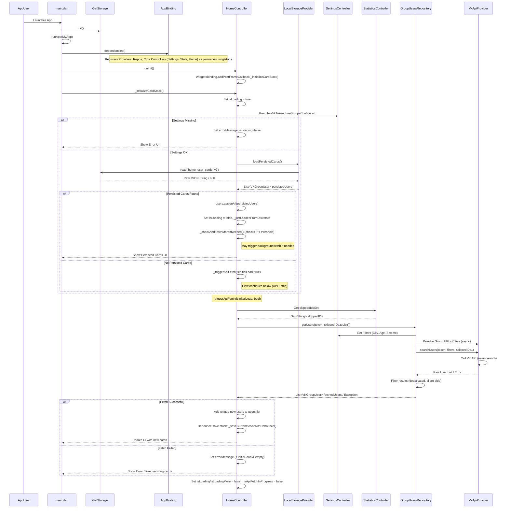
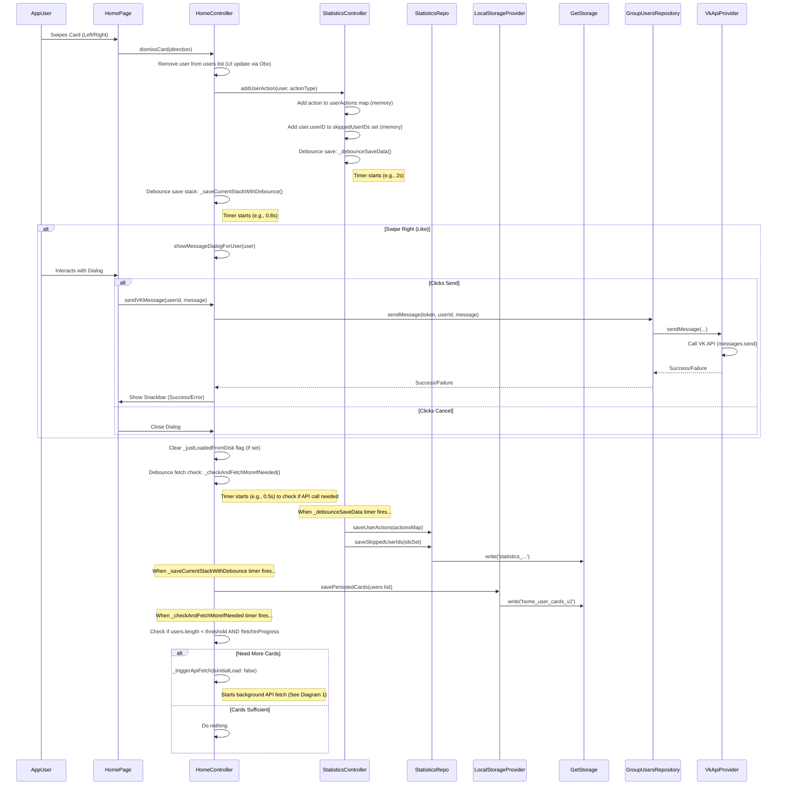

# VK Tinder Clone - Flutter App

A Flutter application demonstrating a Tinder-like interface for discovering VK (Vkontakte) users based on shared groups and user-defined filters. It utilizes the VK API, manages state with GetX, and persists data locally using GetStorage and Hive database.

(!) App does not utilises any backend, all data stored locally  (!)

Some parts os code was written by hands, but many parts are written by LLM, like this doc

## Features

*   **VK API Integration:** Fetches user data using a provided VK access token.
*   **Configurable Filters:**
*   Search within specific VK Groups (by URL or screen name).
*   Filter by City/Cities.
*   Filter by Age Range.
*   Filter by Sex (Female, Male, Any).
*   Optionally skip profiles with limited access (closed wall/messages).
*   Optionally filter by relationship status (single/not specified/actively searching).
*   **Tinder-like Swiping:**
*   View user cards one by one.
*   Swipe right to "Like".
*   Swipe left to "Dislike".
*   **User Details:** Tap a card to view a more detailed profile (fetched on demand), including photos and common groups (if accessible).
*   **Messaging:** Option to send a predefined or custom message upon liking a user (requires `messages` permission for the token).
*   **Persistence:**
*   Remembers the current stack of user cards between app sessions.
*   Saves all liked/disliked users to prevent showing them again.
*   Persists user settings (token, filters, theme).
*   **Statistics:** View a history of liked and disliked users, filterable by group.
*   **State Management:** Uses GetX for dependency injection, state management (`.obs`, `Obx`), and routing.
*   **Local Storage:** Uses GetStorage for simple key-value persistence and Hive database for high-performance data storage (user cards, statistics, etc.).
*   **Theming:** Supports Light, Dark, and System themes.
*   **Mock Data:** Includes a flag (`_useMockData` in `VkApiProvider`) to use simulated data for development without hitting the VK API.

## Architecture Overview

The app follows a layered architecture facilitated by GetX:

*   **`lib/`**
*   **`main.dart`**: App entry point, GetStorage initialization, `GetMaterialApp` setup.
*   **`routes/`**: Defines app routes (`AppPages`) and initial bindings (`AppBinding`). `AppBinding` registers permanent services, repositories, and core controllers.
*   **`core/`**: Contains core functionalities like theming (`ThemeService`).
*   **`data/`**: Handles data sourcing and manipulation.
    *   `models/`: Defines data structures (`VKGroupUser`, `VKGroupInfo`, `StatisticsUserAction`).
        *   `hive/`: Contains Hive models for efficient database storage (`HiveVKGroupUser`, `HiveStatisticsUserAction`, `HiveSkippedUserIds`).
    *   `providers/`: Direct interaction with external sources.
        *   `vk_api_provider.dart`: Makes actual HTTP calls to the VK API using Dio. Includes error handling and mock data logic.
        *   `local_storage_provider.dart`: Handles reading/writing data to `GetStorage` and delegates performance-critical operations to `HiveStorageProvider`.
        *   `hive_storage_provider.dart`: Manages Hive database operations for efficient storage of user cards, statistics, and skipped user IDs.
    *   `repositories/`: Abstract the data sources for the presentation layer.
        *   `group_users_repository_impl.dart`: Combines API calls (via `VkApiProvider`) to fetch and process user lists and profiles.
        *   `settings_repository_impl.dart`: Manages saving/loading application settings using `LocalStorageProvider`.
        *   `statistics_repository.dart`: Manages saving/loading swipe actions and the set of all skipped user IDs using Hive database.
*   **`presentation/`**: Contains the UI and state management logic.
    *   `controllers/`: GetX controllers managing the state and business logic for different parts of the app (`HomeController`, `SettingsController`, `StatisticsController`, `UserDetailController`, `NavController`).
    *   `pages/`: Screen widgets (`HomePage`, `SettingsPage`, `StatisticsPage`, `UserDetailsPage`, `MainScreen`).
    *   `widgets/`: Reusable UI components (`UserCard`).

## Core Workflows & Diagrams

### 1. App Startup & Initial Card Loading

This diagram shows how the app loads the initial set of user cards when started.



### 2. User Swipe Action

This diagram shows the sequence when a user swipes a card left or right.



## Extending Functionality

Here's where to look when adding new features:

**1. Adding a New Search Filter (e.g., "Online Now"):**

*   **VK API Check:** First, verify if the `users.search` method in the VK API supports this filter directly (e.g., `online=1`).
*   **If Yes (API Filter):**
    *   `lib/data/providers/vk_api_provider.dart`: Add the `online` parameter to `searchUsers` and the mock `_getMockSearchUsers`.
    *   `lib/data/repositories/group_users_repository_impl.dart`: Get the setting value in `getUsers` and pass it to `_apiProvider.searchUsers`.
*   **If No (Client-Side Filter):**
    *   `lib/data/repositories/group_users_repository_impl.dart`: In `getUsers`, *after* fetching the `batch` from the API, add another `.where()` clause to filter the `batch` list based on the `user.online` field before adding users to `foundUsers`.
*   **Settings Storage:**
*   `lib/data/providers/local_storage_provider.dart`: Add a new const key (e.g., `_onlineOnlyKey`), add `getOnlineOnly()` and `saveOnlineOnly(bool value)` methods.
*   `lib/data/repositories/settings_repository_impl.dart`: Add `getOnlineOnly()` getter, add `onlineOnly` parameter to `saveSettings`, update the `saveSettings` call to include the new provider method.
*   **Settings State:**
*   `lib/presentation/controllers/settings_controller.dart`: Add `final RxBool onlineOnly = false.obs;`. Update `loadSettings` to load the value. Update `saveSettings` method signature and call to pass the value. Add listener for `settingsChanged.value++` if this filter should trigger a full refresh.
*   **Settings UI:**
*   `lib/presentation/pages/settings_page.dart`: Add a `SwitchListTile` bound to `controller.onlineOnly` within the `_buildSettingsForm`.

**2. Adding a New User Action (e.g., "Add to Favorites"):**

*   **Define Action:** Add a constant like `const ActionFavorite = "favorite";` in `lib/data/models/statistics.dart`.
*   **UI Trigger:** Add a new button/gesture in `lib/presentation/pages/home_page.dart` or `lib/presentation/pages/full_user_info.dart`.
*   **Controller Logic:**
*   In `HomeController` or `UserDetailsController`, add a method (e.g., `addToFavorites(VKGroupUser user)`).
*   Inside this method:
    *   Call `_statisticsController.addUserAction(user, ActionFavorite)`.
    *   If the action removes the card (like swipe), remove from `HomeController.users` and trigger saves/fetches as done in `dismissCard`.
    *   Provide UI feedback (Snackbar, animation).
    *   If it needs a separate API call (e.g., a VK API method to *actually* favorite), call the relevant repository method.
*   **Statistics:**
*   `lib/presentation/controllers/statistics_controller.dart`: No change needed for `addUserAction`, but update any summary calculations if required.
*   `lib/presentation/pages/statistics.dart`: Update the UI (`_buildUserActionCard`, filters, summary stats) to display or handle the new `ActionFavorite`.
*   **(Optional) API Interaction:**
*   `lib/data/providers/vk_api_provider.dart`: Add new API call method (e.g., `vkAddToFavorites(userId)`).
*   `lib/data/repositories/group_users_repository_impl.dart` (or a new repo): Add method calling the provider method.

**3. Adding a New Screen (e.g., "Liked Users List"):**

*   **Route:**
*   `lib/routes/app_pages.dart`: Define a new route constant (e.g., `static const LIKED = '/liked';`). Add a `GetPage` entry pointing to your new page widget and potentially a new `Binding`.
*   **Page Widget:**
*   Create `lib/presentation/pages/liked_users_page.dart`. This will likely be a `GetView<LikedUsersController>`. Design the UI (e.g., a `ListView`).
*   **Controller:**
*   Create `lib/presentation/controllers/liked_users_controller.dart` extending `GetxController`.
*   Inject `StatisticsController` (`Get.find()`).
*   Add an `RxList<StatisticsUserAction> likedUsers = <StatisticsUserAction>[].obs;`.
*   In `onInit` or `onReady`, filter the data from `StatisticsController.userActions` to get only liked users and populate `likedUsers`. Use listeners or `Workers` if you need it to update live as stats change.
*   **Binding:**
*   Decide if the controller needs its own binding or if `AppBinding` is sufficient. If it's simple, `AppBinding` + `Get.lazyPut(() => LikedUsersController())` might work.
*   **Navigation:** Add a way to navigate to this page (e.g., a button in `StatisticsPage` or `MainScreen`).

**4. Changing VK API Call Logic:**

*   **Provider:** Modify the relevant method in `lib/data/providers/vk_api_provider.dart`. Update parameters, API endpoint, fields requested, error handling, and the corresponding mock method.
*   **Model:** Update the model in `lib/data/models/` if the API response structure changes. Ensure `fromJson` and `toJson` (if used for persistence) are updated.
*   **Repository:** Update the method in the relevant repository (`GroupUsersRepository`, etc.) that calls the provider method. Adjust how it processes the data returned by the provider.
*   **Controller:** Update how the controller calls the repository and uses the returned data.

## Configuration

1.  **VK API Token:** The most crucial step is obtaining a VK API Access Token.
*   Go to a service like [vkhost.github.io](https://vkhost.github.io/) or use the VK developer documentation to create a standalone application.
*   Ensure the token has at least the following permissions (scopes):
    *   `groups` (to read group members)
    *   `offline` (so the token doesn't expire quickly)
    *   `messages` (if you want the "Send Message" feature to work)
*   Copy the received token.
2.  **Enter Token:** Paste the token into the "VK API Токен" field in the app's Settings page and save.
3.  **Add Groups:** Add at least one public VK group URL or screen name (e.g., `vk.com/team` or `flutterdev`) in the Settings page to start searching.

## Running the App

1.  Ensure you have Flutter installed.
2.  Clone the repository.
3.  Navigate to the project directory: `cd vktinder`
4.  Install dependencies: `flutter pub get`
5.  Generate Hive adapters: `flutter pub run build_runner build --delete-conflicting-outputs`
6.  Run the app: `flutter run`
7.  Navigate to Settings, enter your VK Token and add target groups.
8.  Go back to the Home page to start swiping.

### Hive Database

The app uses Hive database for efficient storage of user cards, statistics, and skipped user IDs. This provides better performance when dealing with thousands of cards compared to the previous GetStorage implementation.

If you make changes to the Hive models, you'll need to regenerate the adapters:

```bash
flutter pub run build_runner build --delete-conflicting-outputs
```

The Hive models are located in `lib/data/models/hive/` and include:
- `HiveVKGroupUser`: For storing user cards
- `HiveStatisticsUserAction`: For storing user actions (likes/dislikes)
- `HiveSkippedUserIds`: For storing skipped user IDs

## Mock Data Mode

For development and testing without hitting the actual VK API (and avoiding rate limits or using a test token), you can enable mock data:

1.  Open `lib/data/providers/vk_api_provider.dart`.
2.  Change the line `static const bool _useMockData = false;` to `static const bool _useMockData = true;`.
3.  Hot restart the application.

The app will now use predefined mock data for users, photos, groups, etc. Remember to set it back to `false` for real API usage.
